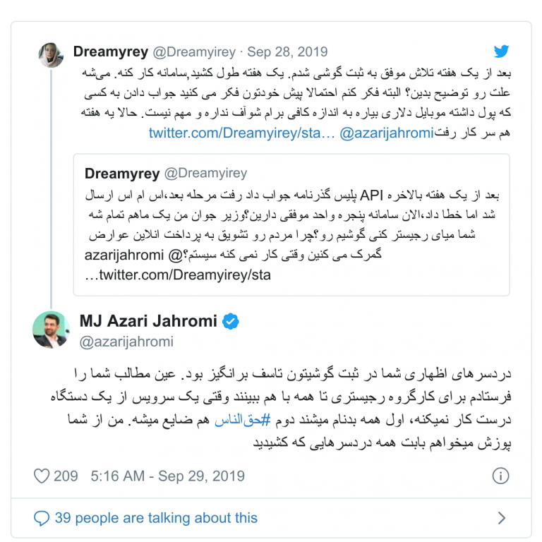
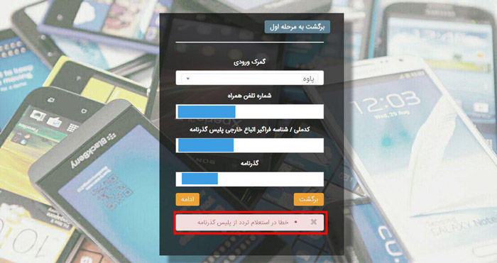
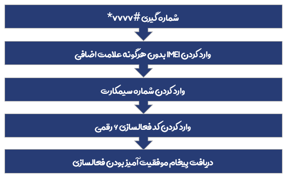
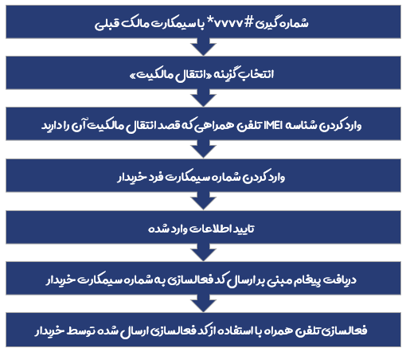
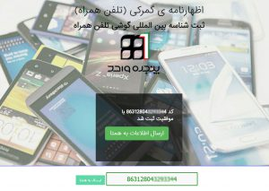

# رجیستری گوشی مسافری و دریافت آنی پیامک فعالسازی

ثبت گوشی مسافری و رجیستری قانونی گوشی های مسافرتی با آموزش پرداخت عوارض گمرکی از سایت رسمی گمرک دریافت کد آنی فعالسازی همتا مشکلات گمرک.
<!--more-->

[طرح رجیستری موبایل](./) با هدف جلوگیری از وارد کردن گوشی های قاچاق به داخل کشور ایجاد شده است. طبق این طرح تمامی گوشی های موبایل و دستگاه های وارد شده به کشور ۳۰ روز مهلت دارند تا با استفاده از شناسه گوشی تلفن همراه IMEI اقدام به پرداخت عوارض گمرک (۱۶% ارزش گوشی با دلار سامانه سنا) و پس از آن رجیستر در سامانه هوشمند مدیریت تجهیزات ارتباطی (همتا) نمایند؛ در غیر این صورت دستگاه مذکور غیر قانونی و قاچاق شناخته خواهد شد و از اپراتورهای موبایل سرویس نخواهد گرفت. در [این پست راهکار سورینت برای رجیستری گوشی مسافری و دریافت آنی پیامک فعالسازی](./) را برایتان شرح می دهیم.

## چند نکته مهم 
* برای رجیستر یک گوشی رجیستر نشده یا باید مسافر باشید که در دو ماه اخیر وارد کشور شده باشید یا از پاسپورت یکی از اقوام و آشنایان خود که در سه ماه اخیر وارد کشور شده باشد استفاده کنید.
* طبق ظوابط گمرک حتما میبایست تمامی اطلاعات به نام یک شخص باشد (پاسپورت، کدملی، شماره موبایل).
* هر کاربر میتواند ۱ گوشی مسافری در هر سال ثبت کند، پس اگر در سال جاری با پاسپورت خود گوشی رجیستر کرده اید باید از پاسپورت شخص دیگری استفاده کنید.

## راهکار سورینت وب 
با توجه به نوپا بودن [طرح رجیستری گوشی های تلفن همراه](./) و کم بودن تعداد گوشی های مسافری وارد شده به ایران سامانه پنجره واحد گمرک مشکلاتی از قبیل عدم شناسایی IMEI گوشی، عدم برقراری ارتباط با پلیس گذرنامه، عدم ارسال پیامک فعالسازی، عدم ارسال پیامک پرداخت گمرکی و... برای کاربران ایجاد کرده که اکثرا بدلیل برقرار نشدن ارتباط با api و یا مسائلی از این دست می باشد.
به شما پیشنهاد می شود در صورتیکه تخصص لازم برای ثبت گوشی در اظهارنامه گمرکی را ندارید، ثبت گوشی خود در همتا و پرداخت عوارض گمرکی آنرا با کمک [کارشناسان ما](./) انجام دهید تا میزان خطا را به صفر برسانید.
ما در [سورینت وب](/) همواره تلاشمان این بوده تا مشتری را راضی نگه داریم برای همین قیمتی که به عنوان حق الزحمه کارشناسان باتجربه رجیستری دریافت می شود تنها ۲۰ هزار تومان است که بسیار پایین تر از مبالغیست که توسط مغازه داران و گوشی فروشان و همچنین سایت های مشابه دریافت می شود.


با توجه به قوانین و مقررات جدید تا اطلاع بعدی ارائه این سرویس **امکان پذیر نمی باشد**.


## سوالات متداول 
بیشترین سوالاتی که کاربران از ما میپرسند در ادامه آورده شده است. اگر سوالی در مورد نکته خاص یا فرایند کار دارید موارد زیر را بررسی بفرمایید یا در قسمت نظرات پایین صفحه مطرح کنید.

### مراحل و زمان رجیستری
* از طریق ~~فرم بالا~~ اطلاعات دقیق گوشی و مشخصات خود را وارد و هزینه کارشناس را به صورت آنلاین پرداخت کنید.
* کارشناس حداکثر در یک روز کاری با شماره همراه شما یا آی دی تلگرام شما تماس میگیرد (همچنین میتوانید با آی دی تلگرام پشتیبانی تماس بگیرید) و مراحل ثبت اطلاعات شما انجام خواهد شد سپس هزینه عوارض گمرک دستگاه شما، استعلام و شناسه پرداخت با توضیحات مربوطه برای شما پیامک می شود.
* کد فعالسازی ۶ رقمی برای شما پیامک می شود، با استفاده از کد ارائه شده با توجه به عکس زیر اقدام به فعالسازی (رجیستری) موبایل نمایید.

### هزینه دستمزد کارشناس برای چیست؟
همانطور که میدانید گمرک اصلاحیه ندارد اگر مواردی اشتباه ثبت شود نه وجهی برگشت داده می شود نه کار شما انجام می شود بدین منظور کارشناسان ما با توجه به دانش فنی خود صفر تا صد اقدامات [ثبت و رجیستری گوشی](./) شما را بر عهده میگیرند همچنین در همان روزکاری کد فعالسازی برای شما اخذ می شود و نیازی به انتظار چند هفتهای نیست هزینه ذکر شده نیز برای این منظور است.

### هزینه گمرکی گوشی من چقدر است؟
عوارض گمرک هر گوشی نسبت به قیمتش با گوشی دیگر متفاوت است و یک نرخ مشخص وجود ندارد. بر اساس اطلاعیه رسمی که سازمان گمرک جمهوری اسلامی ایران ارائه کرده است: ۴ درصد حق گمرک + ۲ درصد سود بازرگان + ۹ درصد مالیات بر ارزش افزوده + ۱ درصد عوارض هلال احمر= جمعا ۱۶ درصد قیمت (به دلار سامانه سنا) مدل دقیق گوشی شما که در سازمان ثبت شده است به عنوان عوارض گمرکی گوشی شما محسوب می شود. حتما میبایست ~~فرم بالا~~ را پر کنید تا استعلام دقیق بگیریم و آن را برای شما پیامک کنیم.

### پاسپورت ما تا چه زمانی معتبر است؟ 
در واقع بیشتر از ۲ ماه و کمتر از ۳ ماه شما مهلت دارید بعد از ورود به ایران با آن گذرنامه اقدام فرمایید به صورت دقیق تر شما هر ماهی که تشریف آوردید (روزش مهم نیست) تا ۳۰ام دو ماه بعد آن فرصت دارید که ۱ دستگاه را ثبت کنید.

### عوارض گمرک را پرداخت کردم ولی هنوز کد فعالسازی برای گوشی پیامک نشده است! 
اگر عوارض گوشی خود را پرداخت کردید و هنوز کد را دریافت نکردید میتوانید از با پرداخت حقالزحمه کارشناس ما انجام باقی مراحل و دریافت آنی پیامک را به ما بسپارید. این ایراد بسیار متداول است و به علت اشکال و اختلال در API سامانه پنجره واحد گمرک رخ می دهد.

### اگر با مشخصات شخص دیگری ثبت کنیم بعدا میتوانیم انتقال بدیم؟ 
بله امکان انتقال مالکیت به سادگی وجود دارد طبق آموزش زیر:

### مدل دقیق دستگاه من در گمرک نیست؟ 
اگر مدل شما در بانک اطلاعاتی همتا و گمرک نباشد میبایست از طریق [میز خدمت](http://help.irica.ir/) یک درخواست کتبی ارسال کنید تا گوشی شما را اضافه کنند این روال ممکن است تا چندین هفته به طول بیانجامد! بعد از اضافه شدن این امکان وجود دارد تا ادامه کارها را از طریق ~~فرم بالا~~ انجام دهیم.

### اگر بعد از مهلت ۳۰ روزه ثبت کنیم کد فعالسازی برای ما ارسال خواهد شد؟ 
بله تا زمانی که پاسپورت شما مهلت داشته باشد (حدود ۲ ماه بعد از ورود به کشور) میتوان ۱ گوشی را رجیستر و ثبت در شبکه کرد، صرفا بعد از مهلت ۳۰ روزه آنتن شما از دست میرود و باید شماره خود را در دستگاه فعال دیگری قرار دهید که بعد از ثبت پیامک فعالسازی را دریافت کنید.

### بعد از پرداخت گمرک چه مدتی طول میکشد تا کد فعالسازی همتا برای ما ارسال شود؟ 

از این سرویس ۹۹ درصد گوشی ها به صورت آنی و سیستمی بعد از پرداخت عوارض گمرک، کد فعالسازی را دریافت میکنند. نیازی به صبر کردن ۱ الی ۲ هفته برای ارسال و بررسی نیست!

### آیا تبلت نیاز به رجیستر دارد؟ 
خیر، در حال حاضر تبلتها جز طرح نیستند ولی ممکن است در آینده به آن اضافه شوند بنابراین پیشنهاد میکنیم اگر دستگاه تبلت سیم کارت خور دارید در اسرع وقت یک خط از خودتان در دستگاه قرار دهید و یک تماس برقرار کنید دستگاه به صورت خودکار برای آن شماره فعال خواهد شد.

### مسافران عراق و عربستان هم از طریق فرم بالا اقدام کنند؟ 
بله، کلیه مسافران هر کشوری از جمله زائران و کاروان عتبات عالیات یا حج که از یکی بازارهای گوشی همراه در هر یک از شهرهایی مانند نجف، کربلا، کوفه، کاظمین، سامرا و… در کشور عراق و یا مکه، مدینه، ریاض و… در عربستان سعودی موبایل تهیه کردند قادر هستند برای رجیستر دستگاه خود از طریق ~~فرم بالا~~ اقدام کنند.

### مسافر زیر ۱۸ سال سن 
برای کلیه مسافرانی که زیر سن قانونی هستند به دلیل اینکه نمیتوانند سیم کارتی به نام خود داشته باشند نمیتوان از گذرنامه آنها برای رجیستر تلفن همراه استفاده کرد.

## لیست برخی از مشکلات رجیستری 
* عدم ارسال کد فعالسازی از گمرک
* ارور عدم صدور شناسه پرداخت
* عدم وجود اطلاعات برند و مدل گوشی شما در همتا
* جعلی بودن IMEI
* مشکلات انتقال مالکیت
* ارور خطا در استعلام IMEI از سامانه همتا
* و…

کارشناسان ما با توجه به تجربه و دانش فنی خود در زمینه ثبت و رجیستری گوشی های مسافری و غیر مسافری (هرگونه موبایل بدون کد فعالسازی) اقدام به رفع مشکل موارد خاص مانند لیست بالا می کنند.


* تمامی مراحل ثبت قانونی به نام شخص و با اطلاعات ارائه شده از طریق سامانه رسمی گمرک خواهد بود.
* مسئولیت ارسال اطلاعات اشتباه در ~~فرم بالا~~ به عهده کاربر است.
* در صورت عدم یا تاخیر در سرویس دهی گمرک یا سامانه همتا “[سورینت](/)” مسئولیتی ندارد.
* اگر به هر دلیلی پس از پرداخت دستمزد کارشناس، قصد انصراف از انجام روال ثبت رجیستری دستگاه خود را دارید ۱۰% مبلغ واریزی کسر و الباقی در حداکثر ۳ روز کاری واریز خواهد شد.
* سرویس فوق خدمتی است از مجموعه ای خصوصی برای کاربرانی که اطلاعات کافی جهت رجیستری گوشی خود از مرجع رسمی را ندارند.


