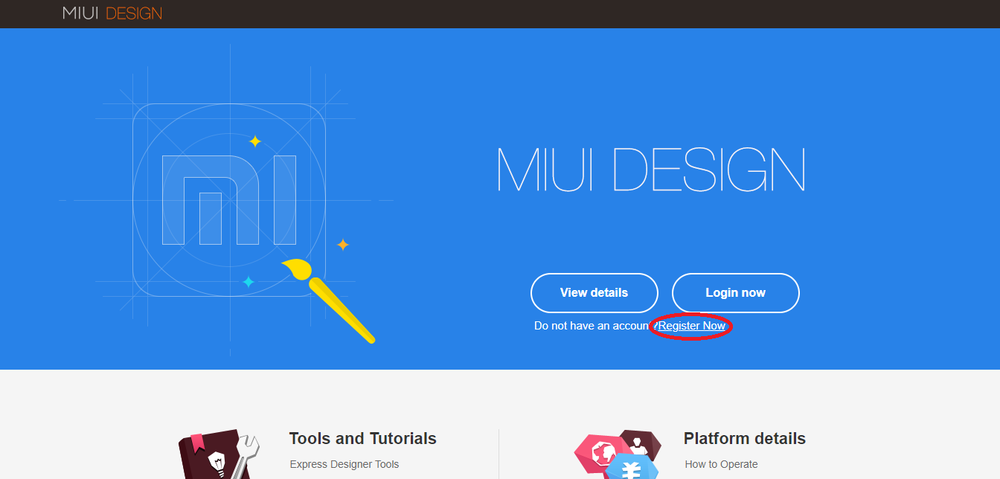
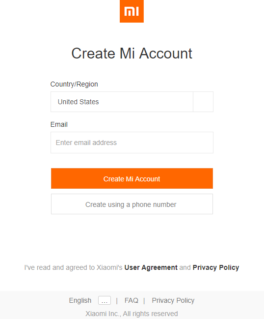
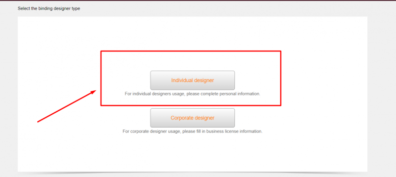
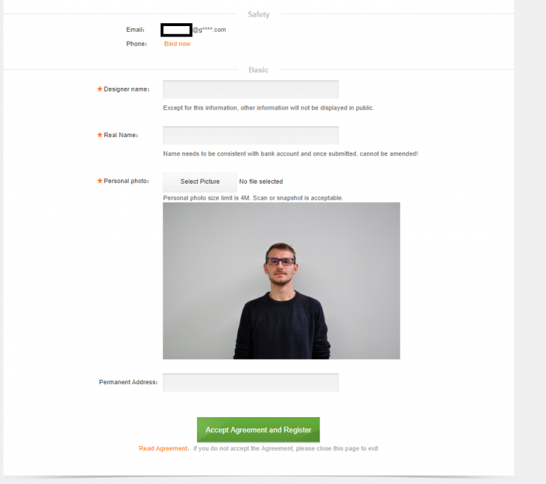
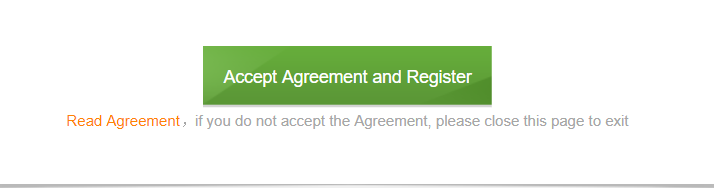

# راهنمای گام به گام آپلود تم و فونت در تم‌استور شیائومی


ایجاد حساب توسعه‌دهنده (developer) در تم‌استور شیائومی و آموزش آپلود و ساخت فرمت mtz
<!--more-->

یکی از مهم ترین و برجسته ترین مزیت های استفاده از MIUI باز بودن دست شما در شخصی سازی [محیط کاربری](/) و وجود امکانات و گزینه های متعدد برای شخصی سازی گوشی است. هر کاربر مبتدی می‌تواند به راحتی با کلیک کردن بر روی اپلیکیشن Themes در محیط MIUI و جستجو در میان تم ها و [فونت های منتشر شده](https://t.me/Sorinet) در این اپ و دانلود آن تغییرات مورد علاقه خود را در چند ثانیه اعمال کند.
در این مطلب ما قصد داریم نحوه ساخت اکانت توسعه دهنده (Developer) در تم استور شیائومی و همچنین آموزش آپلود فونت و تم را به شما در ۳ مرحله آموزش دهیم. 


این مطلب در نهم جولای سال 2020 نوشته شده است و ممکن است در زمانیکه این مطلب را می خوانید بعضی از مراحل این آموزش دچار تغییراتی شده باشند.


## ١- ثبت‌نام اولیه در Designer Station 

در مرحله اول به سایت [desginer.xiaomi.com](http://designer.xiaomi.com/) مراجعه کنید و اگر تاکنون Mi Account ندارید طبق تصویر بالا بر روی رجیستر کلیک کنید تا صفحه بعدی که از شما آدرس ایمیل و مشخصاتی را می خواهد باز شود. در غیر این صورت بر روی لاگین کلیک کنید و آدرس ایمیل یا شماره موبایلی که با آن حساب شیائومی خود را فعال کرده‌اید با آن وارد شوید.



## ۲- پر کردن فرم اطلاعات تکمیلی

پس از ثبت نام و ورود با صفحه بالا مواجه می شوید که طبق تصویر بر روی گزینه individual designer کلیک کنید و اطلاعات مورد نیاز را در صفحه بعدی که برایتان باز می شود را وارد کنید


* Designer Name: این اسم در پایین اسم تم و فونت های منتشر شده توسط شما در تم استور نمایش داده می شود.
* Real Name: اسم واقعی و کامل شما.
* Personal Photo: تصویر شما بصورتی که چهره شما بصورت کامل نمایان باشد. ترجیحا سلفی بگیرید. حداکثر حجم تصویر نیز نباید از 4 مگابایت بیشتر باشد.
* Permanent Address: آدرس محل سکونت (نیازی به تکمیل این فیلد نیست؛ از این فیلد برای پرداخت فروش تم های شما استفاده می شود که چون شبکه بانکی ایران تحریم است عملا بی کاربرد می باشد.)


بعد از تکمیل موارد بالا بر روی Accept Agreement And Register کلیک کنید.
تقریبا یک ماه تا 40 روز بررسی و تایید اکانت شما توسط شیائومی زمان می برد. پس از تایید شدن اکانت شما یک ایمیل از طرف Xiaomi دریافت خواهید کرد.
بعد از تایید اکانت به Designer Station دسترسی خواهید داشت. مانند تصویر پایین: 

## ۳- آپلود فونت و تم در اکانت تایید شده شیائومی 
بعد از دریافت ایمیل تاییده از شیائومی می توانید کار خود را با آپلود تم و فونت های موردعلاقه‌تان آغاز کنید.
برای این کار باید فونت های انتخابی شما فرمت .mtz داشته باشند. ابتدا یک فولدر بسازید و طبق نمونه زیر فولدرهای پایین را ایجاد کنید و همچنین یک فایل description.xml ایجاد کنید.



  ```
  Font Folder
├───fonts
├───preview
└───description.xml
  ```
  

فونت های خود را در پوشه fonts جاگذاری کنید و ترجیحا نام آنها را به Roboto-Regular.ttf و اگر نسخه برجسته (Bold) آنرا دارید به Roboto-Bold.ttf تغییر دهید.
همچنین در فایل description.xml متن زیر را کپی کنید و تغییرات زیر را در آن انجام دهید:
١- در خط سوم **نام فونت** را وارد کنید.
۲- در خط چهارم و پنجم **نام اکانت** خود در تم استور را وارد کنید.
۳- در خط هشتم نیز **توضیحاتی** را که می خواهید به مخاطبین نمایش داده شود را وارد کنید.


```xml
<?xml version="1.0" encoding="utf-8" standalone="no"?>
<MIUI-Theme>
<title>B Nazanin</title>
<designer>SorinetWeb</designer>
<author>SorinetWeb</author>
<version>1.0</version>
<uiVersion>8</uiVersion>
<description>For more fonts (Arabic, Persian, English,...) join our channel: t.me/Sorinet برای دریافت فونت های بیشتر و اضافه کردن فونت موردعلاقه خود در کانال عضو شوید
</description>
</MIUI-Theme>
```
  
  

و در پایان تمامی فایل های درون این پوشه را **zip** کرده و فرمت آن را از .zip به .mtz تغییر می دهیم.



برای طراحی تم نیز می توانید از نرم افزار اختصاصی شیائومی استفاده کنید. [برای دانلود آخرین نسخه نرم افزار :(far fa-file-archive fa-fw): اینجا را کلیک کنید.](https://forum.xda-developers.com/showthread.php?t=2366467)




تایید و منتشر شدن فونت و تم های شما در تم استور ممکن است **از ۳ روز تا حدود دو هفته** زمان ببرد و هیچ تاریخ و زمان قطعی برای تایید شدن فونت شما وجود ندارد.



به جهت کامل شدن [این مطلب](./) در صورتی که در هر کدام از مراحل برایتان سوالی پیش آمده در بخش نظرات پایین صفحه با ما به اشتراک بگذارید.
