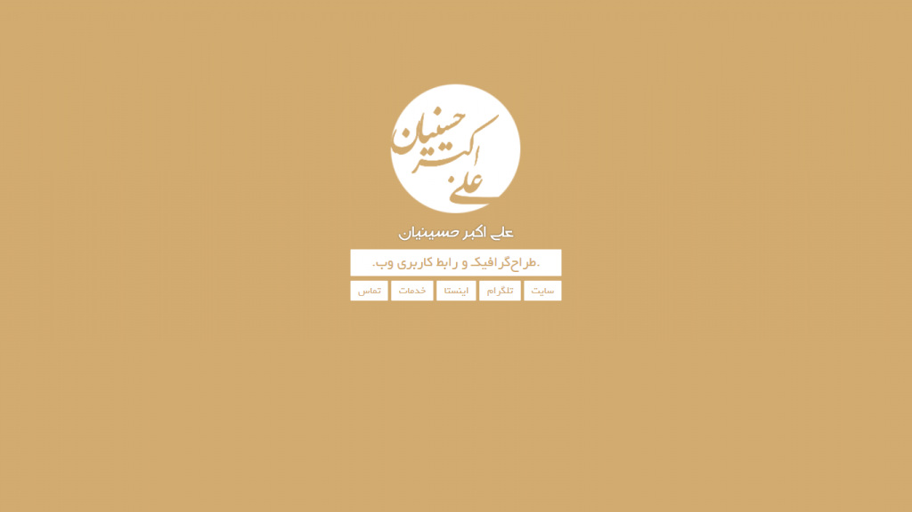
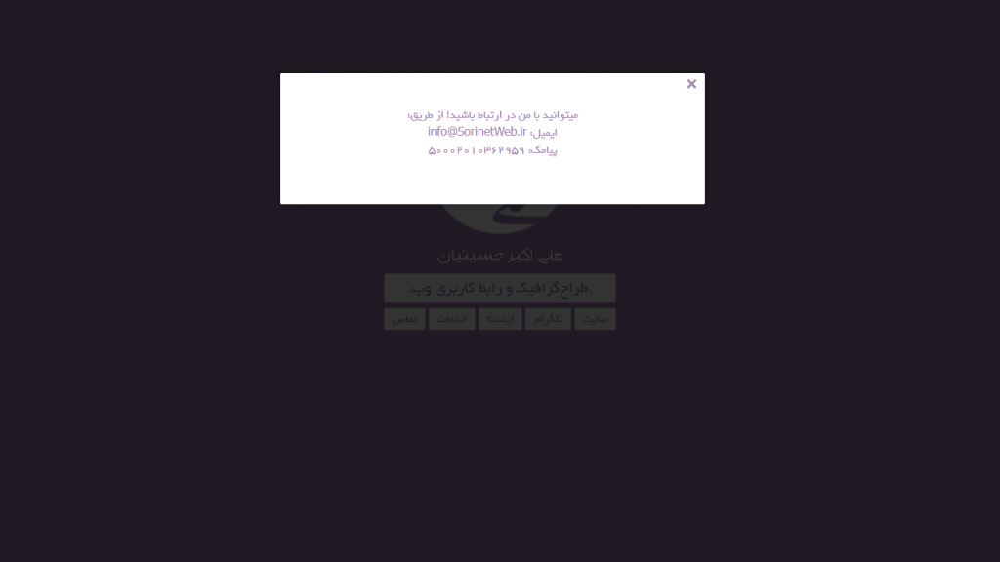
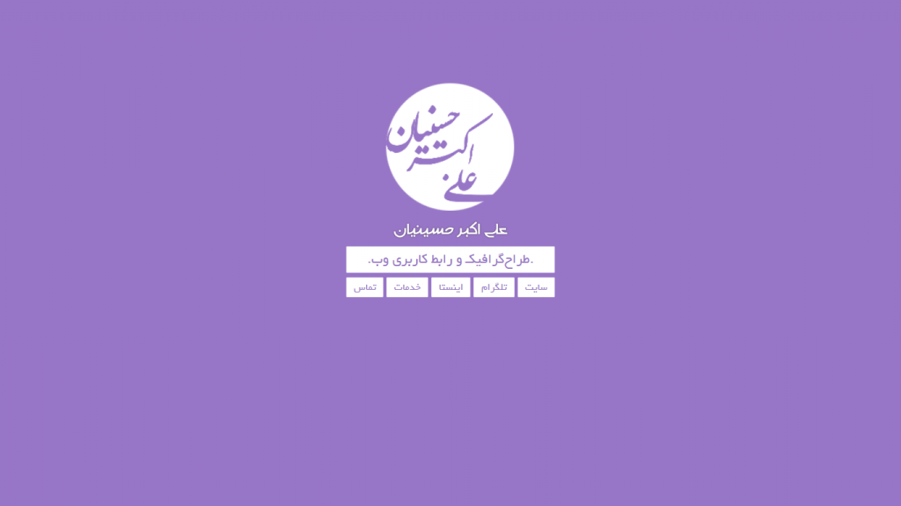
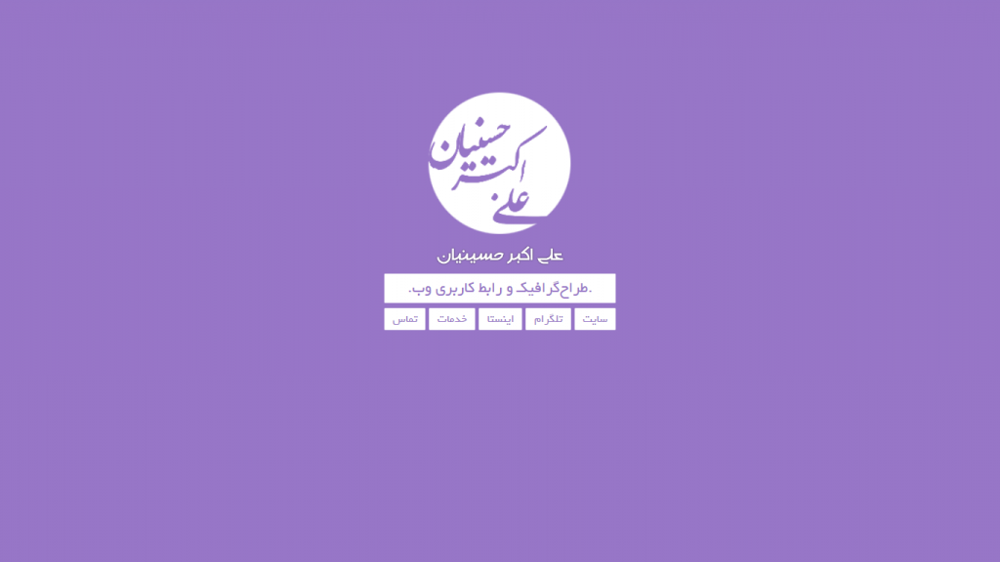
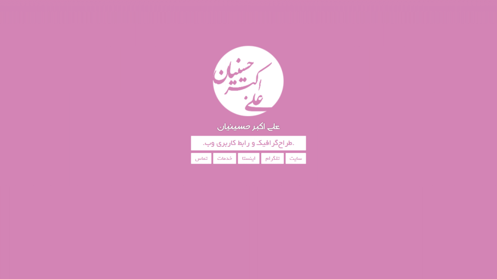
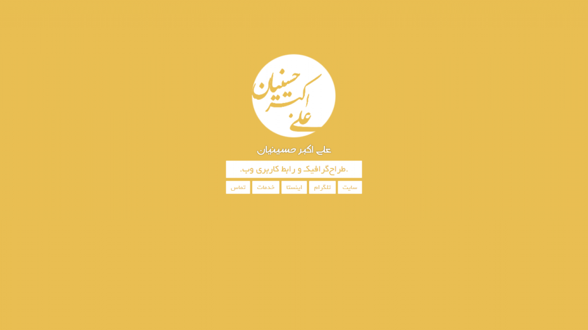
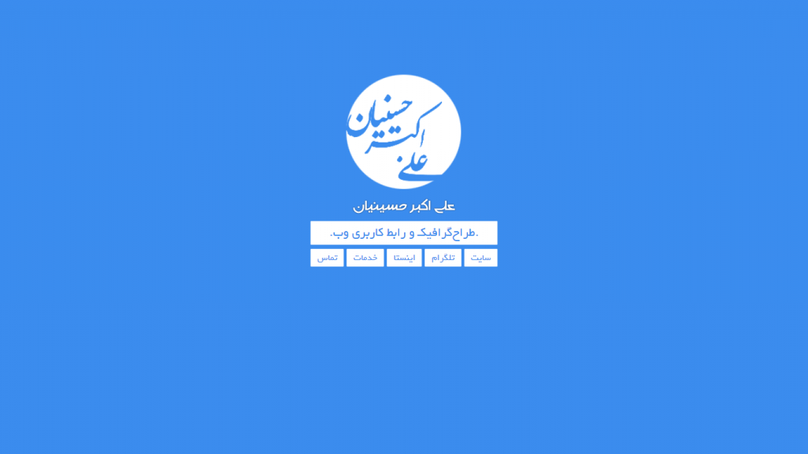
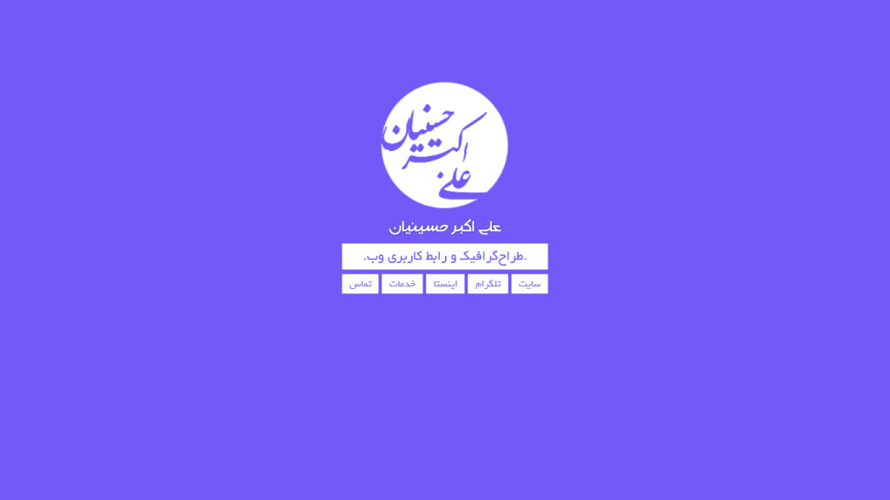

# اسکریپت صفحه شخصی و پروفایل CVsite نسخه ۱

اولین اسکریپتی که در بخش فروشگاه سایت [سورینت وب](/) برای شما مخاطبین گرامی قرار داده می شود، [اسکریپت](/blog/categories/اسکریپت) صفحه شخصی و یا همان رزومه برای معرفی کسب و کار شما می باشد که به وسیله آن قادر خواهید بود با کمترین هزینه و زمان در چند دقیقه کسب و کار خود را به دنیا و سایرین معرفی کنید.
با تهیه [اسکریپت صفحه شخصی و پروفایل CVsite نسخه ۱](./) مخاطبین شما با مراجعه به سایت شما می توانند تخصص، سوابق کاری، شبکه های اجتماعی و رزومه شما و یا هر آنچه که می خواهید به مراجعین و بازدید کنندگان خود ارائه کنید را در قالب یک صفحه کم حجم و زیبا مشاهده کنند. از قابلیت های کلیدی [اسکریپت CVsite](./) می توان به تغییر رنگ پس زمینه به مرور زمان و ایجاد احساس شادابی برای مراجعین وبسایت شما و همچنین وجود فایل لایه باز (psd) لوگو و تایپوگرافی همراه با [اسکریپت](/blog/categories/اسکریپت) اشاره کرد تا بتوانید در چند دقیقه اسکریپت را کاملا شخصی سازی کنید و تایپوگرافی مخصوص خود را داشته باشید.
از دیگر ویژگی های این اسکریپت می توان به [سئوی بالا](/blog/posts/2019/11/14/223/avoid-common-web-seo-mistakes/) و استثنایی آن اشاره کرد، شما با استفاده از این اسکریپت می توانید رتبه های اول نتایج جستجو در گوگل باشید.

## نکته مهم و مژده برای خریداران 

شما با خرید و استفاده از [اسکریپت صفحه شخصی و پروفایل CVsite نسخه ۱](#) می توانید آپدیت ها و بروزرسانی های آینده این [اسکریپت](/blog/categories/اسکریپت) را بصورت کاملا رایگان دریافت کنید و از پشتیبانی ۱۲ ماهه سورینت وب بهره مند شوید!

## امکانات اسکریپت صفحه شخصی و پروفایل CVsite نسخه ۱ 
* رسپانسیو (Responsive) بودن و قابلیت نمایش در تمامی پلتفرم ها
* امکان اتصال صفحات و لینک های شبکه های اجتماعی به پروفایل
* قابلیت اتصال وبلاگ به پروفایل
* تغییر رنگ پس زمینه (flat colors) به مرور زمان و تدریج
* سئوی بالا
* ارائه فایل لایه باز (psd) لوگو و تایپوگرافی همراه با اسکریپت
* سبک بودن و سرعت لود (load) بالا
* و…

## اسکرین شات 
در زیر تصاویری از این کد را مشاهده می کنید:
	|  |  |  |  |
| ----------- | ----------- | ----------- | ----------- |
|  |  |  |  |

## دریافت اسکریپت صفحه شخصی و پروفایل CVsite 

برای خرید و دانلود اسکریپت صفحه شخصی و پروفایل CVsite مخصوص ایجاد رزومه [اینجا را :(far fa-file-archive fa-fw): کلیک کنید.](/)


